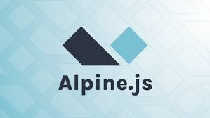

# 👋 Experienced Backend and Frontend Developer

Experienced backend and frontend developer with over 4 years of experience specializing in developing user-friendly, adaptable, and responsive websites with optimal cross-browser compatibility and runtime performance.

## Technologies and Tools

### Programming Languages

  
  

### CSS Frameworks

### JavaScript Frameworks

### CMS & PHP Frameworks

 

### Database Management Systems

